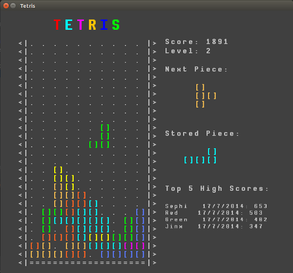

### Tetris Clone - Assignment 1 - CSC2003S

## Description
A clone of the original tetris. Made for my first game development assignment.

Its art-style and gameplay was based on the original tetris and was kept as simplistic as
possible.

It uses:

 * The [libGDX](http://libgdx.badlogicgames.com/) engine.
 * The font, [Novamono](https://www.google.com/fonts/specimen/Nova+Mono), is used for all on
 screen text(including the tetris blocks and grid).
 * [Chiptunes Do Dubstep by TeknoAXE](http://teknoaxe.com/Link_Code_2.php?q=305) for background music.
 * [Beep SF](http://soundbible.com/291-Fuzzy-Beep.html) and [Click SF](http://soundbible.com/772-Button.html) as sound effects.

## Instructions
#### To Run:

> Requires Gradle

Unix based OS: `./gradlew desktop:run`

Windows: `gradlew.bat desktop:run`

#### To Build:

> Requires Gradle

Unix based OS: `./gradlew desktop:dist`

Windows: `gradlew.bat desktop:dist`

The built .jar file will be in `desktop/build/libs/`

To run it, change to the above directory and run: `java -jar desktop-1.0.jar`

## Controls

### Main Menu:

|Key            | Description|
|:--------------|:------------|
|`ENTER`        | Start the game.|
|`H`            | Displays the controls|
|`C`            | Clear the highscore list|
|`M`            | Mute music|
|`N`            | Mute sound effects|
|`Q`            | Quits the game.|

### In-game:

|Key            | Description|
|:--------------|:------------|
|`SPACE`        | Drop the currently controlled block.|
|`LEFT SHIFT`   | Store the currently active block and replace it with the next block. (Can only be done once per block)|
|`UP ARROW`     | Rotate the currently active block 90o clockwise.|
|`RIGHT ARROW`  | Move the currently active block one space to the right.|
|`LEFT ARROW`   | Move the currently active block one space to the left.|
|`ESCAPE`       | Pause the game. Push again to unpause.|
|`M`            | Mute music|
|`N`            | Mute sound effects|
|`R`            | Restart the game.|
|`Q`            | Quits the game.|

## Gameplay

The gameplay involves the player moving and positioning the various pieces in an attempt to complete
rows and avoid the blocks stacking to the top of the play area.

The player starts out with 0 points on level 1. As the completes rows, places pieces (or drops
them) they get points. When the points pass `level * 1000` the player levels up.

Levelling up increases the gravity which controls the speed of the blocks descent as well as the
number of points received for placing a block.

The speed at which the block falls is: `800ms / (gravity * gravityModifier)`

The gravityModifier is used to speed up the block when the player push on the `DOWN` arrow key.

The player can move the blocks left or right and the blocks can be rotated by pushing the `UP`
arrow key.

If the player wishes, a single block can be stored by pushing `LEFT SHIFT`. If there is already a
stored block, the current block and stored block are swapped. Once a player has stored or
swapped a block, they can only do it again once they have place their new block. Swapping the
block provides a tactical edge as the new block starts at the top of the screen and it allows
you to save a piece you think you might need or swap out a useless block.

The player can drop the block from its current position. It will stop when it collides with the
floor or another block. The player gets points depending on the height the block drops from, so
you get more points by dropping the block instead of letting it fall.

The player receives points when a row is completed, the points gained are calculated as follows:
`(50 * rowsRemoved)`. So the more rows completed at once, the more points gained. When a block
lands, the player gets 25 points.

After the blocks land, there is a time (the same as the rate at which the block falls) in which the
block can be moved.

Finally, once the game is over, if the player has amassed enough points, more than the person
with the least points on the high score list, they will be prompted to enter their name. Their
score will be recorded and added to the list. The list is saved using the libGDX engine to the
local PC so the highscore list is persistent on the current PC.

